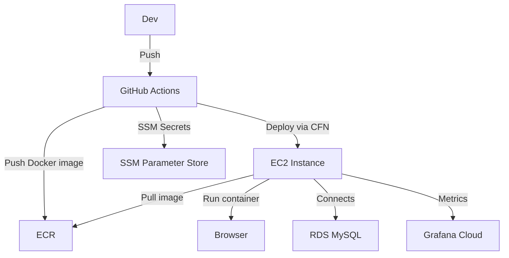

# 🚀 PHP MySQL App on AWS with Monitoring & CI/CD

[](https://github.com/aman26ps/php-mysql-app/actions)
[](LICENSE)

A containerized PHP application with MySQL backend, deployed on AWS infrastructure (EC2 + RDS) using CloudFormation. Includes automated CI/CD with GitHub Actions, end-to-end testing via Playwright, and observability via Grafana Cloud using the Alloy agent.

---

## 📦 Tech Stack

- **PHP + MySQL** backend
- **Docker + Compose** for containerization
- **AWS EC2 + RDS** provisioned via **CloudFormation**
- **SSM Parameter Store** for secrets management
- **GitHub Actions** CI/CD with reusable workflows
- **Grafana Cloud + Alloy Agent** for observability
- **Playwright** for functional testing

---

## 📐 Architecture



---

## 🛠️ Local Development

```bash
# Clone repo
git clone https://github.com/aman26ps/php-mysql-app.git
cd php-mysql-app

# Create .env from example
cp .env.example .env

# Start services locally
docker compose -f docker/docker-compose.yml up --build
```

App available at: `http://localhost:8080`

---

## 🔁 CI/CD Pipeline Overview

```mermaid
flowchart LR
  A[🟢 Push to main] --> B[🧪 Lint<br/>CloudFormation Templates]
  B --> C[🔐 Configure AWS Credentials]
  C --> D[🗝️ Import EC2 Key Pair]
  D --> E[🏗️ Deploy Infra<br/>(EC2 + RDS)]
  E --> F[🐳 Build + Push Docker Image<br/>to ECR]
  F --> G[🚀 Deploy App to EC2<br/>via SSM]
  G --> H[📦 Encode Monitoring Files]
  H --> I[📈 Deploy Monitoring Stack<br/>via SSM]
  I --> J[🧪 Run Playwright Tests]

  style A fill:#00b894,color:#fff
  style J fill:#6c5ce7,color:#fff
```
## ☁️ AWS Deployment

> Requires AWS credentials with CloudFormation, EC2, RDS, and ECR permissions.

### ✅ Setup

1. Store your SSH public key in SSM:
   ```bash
   aws ssm put-parameter --name "/phpapp/public-key"      --type "String" --value "$(cat ~/.ssh/id_rsa.pub)"
   ```

2. Store DB credentials in SSM:
   ```bash
   aws ssm put-parameter --name "/phpapp/db_username" --type SecureString --value "admin"
   aws ssm put-parameter --name "/phpapp/db_password" --type SecureString --value "password"
   ```

3. Deploy using GitHub Actions (push to `main` branch):
   - Infrastructure: CloudFormation deploys EC2, RDS
   - Docker image: Built & pushed to ECR
   - EC2: Pulls image and runs container via SSM

---

## 🔐 Security Considerations

- **Secrets** (DB creds, API tokens) are securely stored in **AWS SSM Parameter Store**
- EC2 access is over SSH via key stored in SSM
- IAM role uses **OIDC trust** with GitHub for secure CI/CD role assumption
- RDS is not publicly accessible

---

## 📊 Observability with Grafana Cloud

1. Monitoring stack includes:
   - `agent.alloy.template`
   - `docker-compose.monitoring.yml`
2. Alloy agent is deployed via SSM and Docker Compose
3. Metrics are sent to Grafana Cloud via `prometheus.remote_write`

> Customize via `monitoring/agent.alloy.template`

---

## ✅ Functional Testing

Tests are located in the `tests/` folder and use **Playwright**:

```bash
cd tests
npm install
npx playwright install
npm test
```

---

## 🔁 CI/CD Workflows

Located in `.github/workflows/`

| Workflow         | Description                      |
|------------------|----------------------------------|
| `main.yml`       | Orchestrator, triggers on push   |
| `lint.yml`       | CloudFormation validation        |
| `infrastructure.yml` | Provisions EC2, RDS via CFN |
| `docker.yml`     | Builds/pushes Docker image to ECR |
| `deploy-app.yml` | Sends SSM command to EC2         |
| `deploy-monitoring.yml` | Sets up monitoring stack |
| `functional-test.yml` | Runs Playwright tests       |

---

## 🤝 Contributing

1. Fork the repo
2. Create your feature branch (`git checkout -b feature/my-feature`)
3. Commit your changes
4. Push and open a pull request


